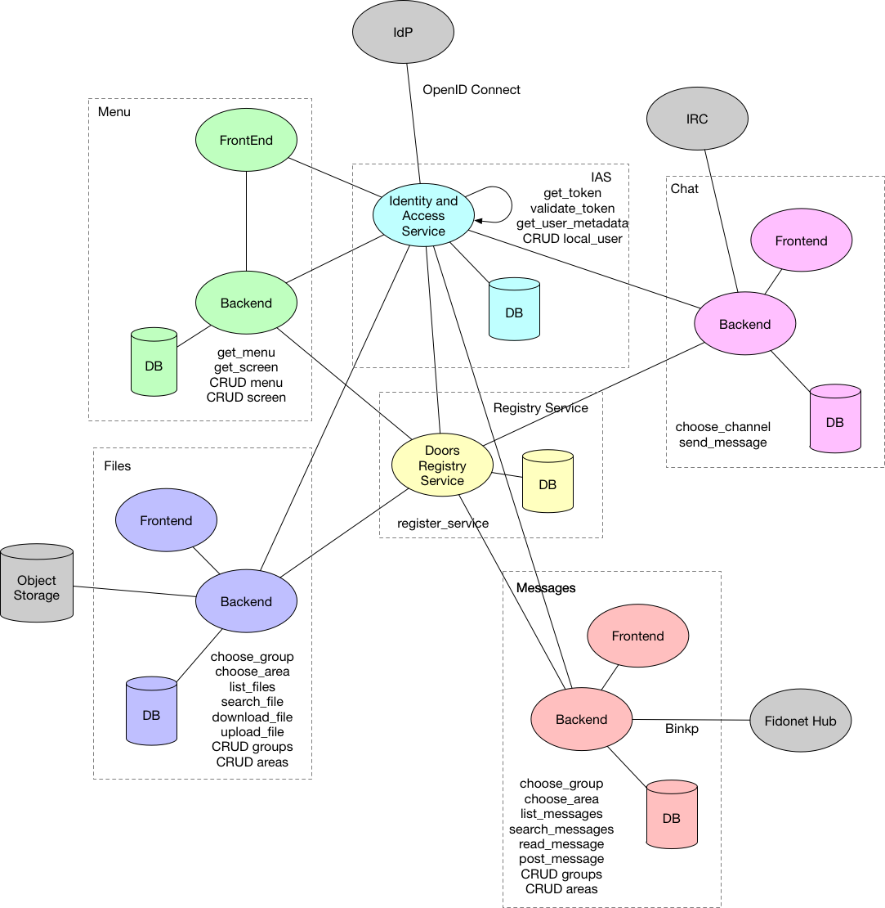

# BbS4bBs

* [Summary](#summary)
* [Architecture](#architecture)
  * [Overview](#overview)
  * [Files](#files)
  * [IAS](#ias)
  * [Menu](#menu)
  * [Messages](#messages)
  * [Service Registry](#service-registry)
* [Doors](#doors)

Summary
-------

The goal of this project is to create an environment for learning multiple technologies using a real complex project.
This project uses a microservices-based architecture, in a way each one of these "Building Block Services" may use a new technology tool or can be implemented with different programming languages.
The chosen use case is a modern version of a [Bulletin Board System](https://en.wikipedia.org/wiki/Bulletin_board_system) (aka BBS), composed of a main menu, a file area, a messages area and external plugins called "doors".

Architecture
------------

## Overview

Below it is the basic BBS architecture. All services will be explained in details in the next sessions.

## Files
Work in progress

## IAS
Work in progress

## Menu
Work in progress

## Messages
Work in progress

## Service Registry
Work in progress

Doors
-----

Doors are external plugins that extend BBS capabilities including new services like chats, games, etc, to the users.
Those services can be stand alone or integrated with other BBS using its own protocol.

